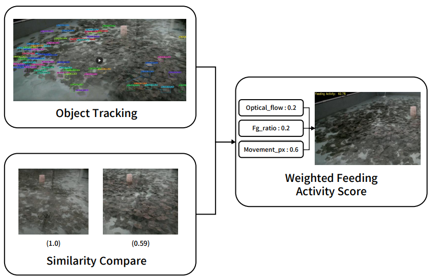

# 넙치 먹이활성도 실시간 산출

Jetson 환경에서 USB 카메라 영상을 입력받아 **넙치 먹이활성도(Feeding Activity)** 를 실시간으로 계산하고, 영상 좌상단에 활성도 값을 오버레이하여 MP4로 저장하는 프로그램,
동시에 시간대별 먹이활성도 계산 결과를 CSV 로그 파일로 저장

이번 버전부터는 기존 Optical Flow / 프레임 차분 기반 특징에 더해, **YOLO 트래킹 기반 개체별 이동량**을 세 번째 특징으로 추가하여 최종 먹이활성도 점수를 산출

---
# 아키텍처
## 

## 1. 주요 기능

- USB 카메라 실시간 입력 처리
- Optical Flow 기반 움직임 강도 계산 (Frame-difference / Motion-based Activity Analysis)
- 프레임 차분 기반 전경 픽셀 비율 계산 (Frame-difference / Motion-based Activity Analysis)
- YOLO 트래킹 기반 개체별 이동량 계산 (Object Tracking-based Movement Analysis)
- EMA 기반 특징값 평활화
- 실시간 min/max 정규화 및 3가지 특징의 가중합을 통한 먹이활성도 점수(Weighted Feeding Activity Score) 산출
- 영상 좌상단에 먹이활성도 퍼센트 및 추적 중인 개체 수 오버레이
- MP4 영상 저장
- CSV 로그 저장
- 모니터가 없는 Jetson 환경을 고려하여 `Ctrl+C`로 종료

---

## 2. 실행 환경

### 하드웨어

- NVIDIA Jetson 보드
- USB 카메라
- 저장 공간이 충분한 로컬 디스크 또는 외부 저장장치
- YOLO 추론이 추가되었으므로, 실시간 처리를 위해서는 GPU(CUDA) 가속이 사실상 필수

### 소프트웨어

- Python 3.x
- OpenCV
- NumPy
- ultralytics (YOLO `.track()` API 사용)

필요 패키지 예시:

```bash
pip install opencv-python numpy ultralytics
```

Jetson 환경에서는 OpenCV가 카메라 및 비디오 인코딩을 제대로 지원하는지 확인 필요

```bash
python3 -c "import cv2; print(cv2.__version__)"
```

ultralytics/torch가 Jetson의 CUDA를 정상적으로 잡는지도 함께 확인 필요

```bash
python3 -c "import torch; print(torch.__version__, torch.cuda.is_available())"
```

---

## 3. 파일 구조 예시

```text
project/
├── feed_activity_Jetson.py
├── best.pt                          <- 넙치 탐지/추적용 YOLO 학습 가중치 (직접 배치 필요)
├── README.md
└── realtime_feeding_output/
    ├── feeding_log_YYYYMMDD_HHMMSS.csv
    └── feeding_overlay_YYYYMMDD_HHMMSS.mp4
```

`best.pt`는 저장소에 포함되어 있지 않으므로, 넙치를 학습한 YOLO 가중치 파일을 코드와 같은 경로(또는 `YOLO_MODEL_PATH`에 지정한 경로)에 준비해야 함

---

## 4. 설정값

코드 상단의 설정 영역에서 카메라 입력, 해상도, FPS, 샘플링 간격, YOLO 추적 관련 값을 수정할 수 있음

```python
CAMERA_INDEX  = 0
CAMERA_WIDTH  = 1920
CAMERA_HEIGHT = 1080
CAMERA_FPS    = 30

SAMPLE_SEC   = 3
RESIZE_WIDTH = 640
EMA_SPAN = 10

YOLO_MODEL_PATH = "best.pt"
YOLO_CONF_THRESH = 0.25
YOLO_IMGSZ = RESIZE_WIDTH
YOLO_TRACK_EVERY_N_FRAMES = 2

FEEDING_SCORE_WEIGHTS = {
    "flow_intensity": 0.2,
    "fg_pixel_ratio": 0.2,
    "avg_mv_px_per_object_sec": 0.6,
}
```

### 주요 설정 설명

| 설정값 | 설명 |
|---|---|
| `CAMERA_INDEX` | USB 카메라 장치 번호입니다. 일반적으로 `/dev/video0`이면 `0`을 사용 |
| `CAMERA_WIDTH` | 카메라 입력 해상도 가로 크기 |
| `CAMERA_HEIGHT` | 카메라 입력 해상도 세로 크기 |
| `CAMERA_FPS` | 카메라 요청 FPS로, 실제 FPS와 다를 수 있음 |
| `SAMPLE_SEC` | 몇 초 간격으로 먹이활성도를 재계산할지 설정 |
| `RESIZE_WIDTH` | Optical Flow/프레임 차분 특징 계산용 축소 해상도, 영상 저장은 원본 해상도로 유지됨 |
| `EMA_SPAN` | 특징값 평활화에 사용하는 EMA 스팬 |
| `YOLO_MODEL_PATH` | 넙치 탐지/추적용 YOLO 가중치 파일 경로 |
| `YOLO_CONF_THRESH` | 이 confidence 이상인 탐지만 추적에 채택 |
| `YOLO_IMGSZ` | YOLO 추론 해상도. `RESIZE_WIDTH`와 같은 스케일을 써서 이동량(px)의 단위를 Optical Flow와 맞춤 |
| `YOLO_TRACK_EVERY_N_FRAMES` | 매 N프레임마다 YOLO 추적 수행 (Jetson 연산 부담 완화 목적). 값이 너무 크면 track id 연속성이 끊겨 이동거리가 과소/과대 추정될 수 있어 2~3 권장 |
| `FEEDING_SCORE_WEIGHTS` | 최종 점수를 만들 때 3가지 정규화된 특징(`flow_intensity`, `fg_pixel_ratio`, `avg_mv_px_per_object_sec`)에 곱하는 가중치. 합이 1이 되도록 설정 |

---

## 5. 먹이활성도 산출 방식

먹이활성도(Weighted Feeding Activity Score)는 성격이 다른 두 계열, 총 세 가지 특징값을 결합해서 계산

- Frame-difference / Motion-based Activity Analysis: `flow_intensity`, `fg_pixel_ratio`
- Object Tracking-based Movement Analysis: `avg_mv_px_per_object_sec`

### 5.1 Optical Flow 기반 움직임 강도 (`flow_intensity`)

이전 샘플 프레임과 현재 샘플 프레임 사이의 움직임을 Farneback Optical Flow로 계산

```python
flow_intensity
```

움직임 벡터의 크기 중 일정 임계값(`motion_threshold=1.0px`) 이상인 값들만 골라 그 평균을 사용. 즉 화면에서 실제로 움직이는 부분이 평균적으로 얼마나 크게/빠르게 움직였는지를 나타냄

### 5.2 프레임 차분 기반 전경 픽셀 비율 (`fg_pixel_ratio`)

이전 샘플 프레임과 현재 샘플 프레임의 절대 차이(`absdiff`)를 계산한 뒤, Otsu threshold로 자동 이진화하여 변화가 발생한 픽셀의 비율을 계산

```python
fg_pixel_ratio
```

`flow_intensity`가 "움직임의 세기"를 본다면, `fg_pixel_ratio`는 "움직임이 차지하는 면적"을 봄

### 5.3 YOLO 트래킹 기반 개체별 이동량 (`avg_mv_px_per_object_sec`)

`YOLO.track(persist=True)`로 프레임마다 개체별 track id를 얻고, 같은 id가 직전 추적 프레임 대비 얼마나 이동했는지(px)를 `SAMPLE_SEC` 구간 동안 누적. 이 방식은 오프라인 분석 스크립트가 만드는 `movement_per_second_feeding.csv`의 정의와 동일하여 같은 로직/그래프 스크립트로 바로 비교·시각화 가능

```python
total_mv_px               # 구간 동안 모든 track의 이동거리 합(px)
avg_mv_px_per_object_sec  # total_mv_px / 구간에 등장한 고유 개체 수 / 구간 길이(sec)
```

이 특징은 앞의 두 특징(움직임의 세기·면적)과 달리, 개체 단위로 "실제로 얼마나 이동했는가"를 직접 추적해서 재는 값. `YOLO_TRACK_EVERY_N_FRAMES` 프레임마다 한 번씩 추적을 수행하며, 한 프레임에서 사라졌다가 다시 나타난 track은 새 시작점부터 이동거리를 다시 누적

### 5.4 EMA 평활화

순간적인 노이즈를 줄이기 위해 세 특징값 모두에 EMA를 적용

```python
ema_flow
ema_fg
ema_move
```


## 6. 출력 파일

프로그램 실행 시 `realtime_feeding_output` 폴더가 자동 생성되며, 실행 시각 기준으로 결과 파일이 저장

### CSV 로그

파일명 예시:

```text
feeding_log_20260707_091500.csv
```

CSV 컬럼:

| 컬럼명 | 설명 |
|---|---|
| `time_sec` | 프로그램 시작 후 경과 시간 |
| `flow_intensity` | Optical Flow 기반 움직임 강도 |
| `fg_pixel_ratio` | 프레임 차분 기반 전경 픽셀 비율 |
| `total_mv_px` | 해당 구간 동안 추적된 모든 개체의 이동거리 합(px) |
| `avg_mv_px_per_object_sec` | 개체 1마리, 1초당 평균 이동거리(px) |
| `object_count` | 해당 구간에서 추적된 고유 개체 수 |
| `feeding_score_pct` | 최종 먹이활성도 점수 |

### MP4 영상

파일명 예시:

```text
feeding_overlay_20260707_091500.mp4
```

저장 영상에는 좌상단에 다음과 같은 텍스트가 표시

```text
Feeding Activity:  75.3%  (obj: 4)
```

---

## 7. 실행 방법

Python 파일이 있는 경로에서 다음 명령어를 실행

```bash
python3 feed_activity_Jetson.py
```

실행 전 `YOLO_MODEL_PATH`(기본값 `best.pt`)에 해당하는 학습된 가중치 파일이 실제로 그 경로에 있어야 함. 없으면 YOLO 모델 로드 단계에서 오류가 발생

실행 후 다음과 같은 로그가 출력됩니다.

```text
라이브러리 로드 완료
CSV 저장 경로  : realtime_feeding_output/feeding_log_YYYYMMDD_HHMMSS.csv
영상 저장 경로 : realtime_feeding_output/feeding_overlay_YYYYMMDD_HHMMSS.mp4
카메라 해상도: 1920x1080  보고된 FPS: 30.0  실측 FPS: 29.8
YOLO 모델 로드 중: best.pt
실시간 먹이활성도 산출 시작 (Ctrl+C로 종료 가능)
```

---

## 8. 종료 방법

모니터가 연결되어 있지 않은 Jetson 환경을 고려하여 키 입력 종료는 사용하지 않음


```text
Ctrl + C
```

정상 종료 시 CSV와 영상 파일이 저장됨

```text
CSV 저장 완료 : realtime_feeding_output/feeding_log_YYYYMMDD_HHMMSS.csv
영상 저장 완료: realtime_feeding_output/feeding_overlay_YYYYMMDD_HHMMSS.mp4
```

---

## 9. 카메라 확인 방법

USB 카메라가 정상적으로 인식되었는지 확인

```bash
ls /dev/video*
```

예시:

```text
/dev/video0
```

카메라 장치 정보 확인:

```bash
v4l2-ctl --list-devices
```

지원 해상도 및 포맷 확인:

```bash
v4l2-ctl --device=/dev/video0 --list-formats-ext
```

---

## 10. 주의사항

### 10.1 실제 FPS와 요청 FPS가 다를 수 있음

코드에서는 `cap.get(cv2.CAP_PROP_FPS)` 값만 사용하지 않고, 짧은 시간 동안 실제 프레임을 읽어 실측 FPS를 계산

### 10.2 실시간 min/max 정규화 특성

프로그램 실행 초반에는 최소값과 최대값 범위가 충분히 쌓이지 않았기 때문에 먹이활성도 값이 불안정할 수 있음

따라서 초기 몇 샘플은 참고값으로 보고, 일정 시간이 지난 뒤의 값을 기준으로 해석하는 것이 좋음

### 10.3 YOLO 트래킹 관련 주의사항

- `best.pt`는 반드시 넙치(대상 어종)로 학습된 탐지/추적용 가중치여야 하며, 코드에는 포함되어 있지 않으므로 별도로 준비해서 배치해야 함
- `YOLO_TRACK_EVERY_N_FRAMES`를 너무 크게 설정하면 같은 개체의 track id가 프레임 사이에서 끊길 수 있고, 이 경우 이동거리가 새 시작점부터 다시 누적되어 `avg_mv_px_per_object_sec`가 과소 추정될 수 있음
- YOLO 추론이 추가되면서 프레임당 연산량이 늘어나므로, Jetson에서 실시간 처리(카메라 FPS를 따라가는 것)가 어렵다면 `YOLO_TRACK_EVERY_N_FRAMES`를 늘리거나, TensorRT 등으로 가중치를 최적화하는 것을 고려
- `YOLO_IMGSZ`는 `RESIZE_WIDTH`와 같은 값을 쓰도록 되어 있음. 이 값을 서로 다르게 바꾸면 `flow_intensity`/`fg_pixel_ratio`와 `avg_mv_px_per_object_sec`의 px 단위 기준이 어긋나므로 함께 맞춰서 변경해야 함
- 코드 주석상 `ultralytics`의 표준 `YOLO().track()` API를 기준으로 작성되어 있음. 별도의 커스텀 API를 쓰는 가중치/런타임이라면 `open_yolo_model()`과 `MovementAccumulator.update()` 내부의 모델 호출부만 그에 맞게 수정하면 됨